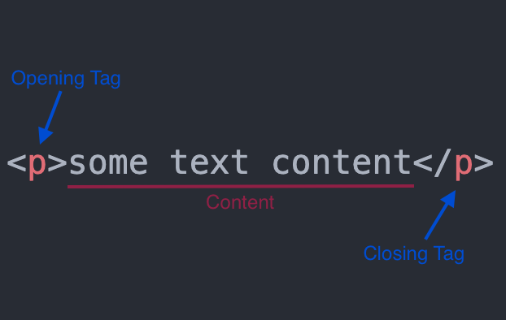

# HTML vs CSS vs Javascript

When you’re designing or developing a website, there are three different coding languages that you will want to be aware of: **HTML**, **CSS**, and **JavaScript**.

- HTML: a language that determines how documents and web pages are displayed in a web browser, the language for the building blocks of any website.
- CSS (Cascading Style Sheets): a popular style sheet language that determines how a document created in HTML is styled (colors, font styles, layout and responsive features).
- Javascript: allows you to change CSS and HTML elements on your website after the site has been loaded, which gives you the ability to make your site more interactive and engaging for users.

Other most common web development languages are:
- Ruby: scalable and fast programming language that can help you build an extensive website or program in just a short period of time
- PHP: often used in WordPress
- SQL: for maintain and optimize large databases in a much more streamlined manner
- Python

**The main language that you use all depends on your specific project and the business goals that you have.** By identifying what these goals are, you should have a better idea of which languages are ideal when you are developing a website or application.

# Elements and Tags

Almost all elements on an HTML page are just pieces of content wrapped in opening and closing HTML tags. A full paragraph element looks like this:

# Other Articles

- [HTML elements reference](https://developer.mozilla.org/en-US/docs/Web/HTML/Element)
- 

